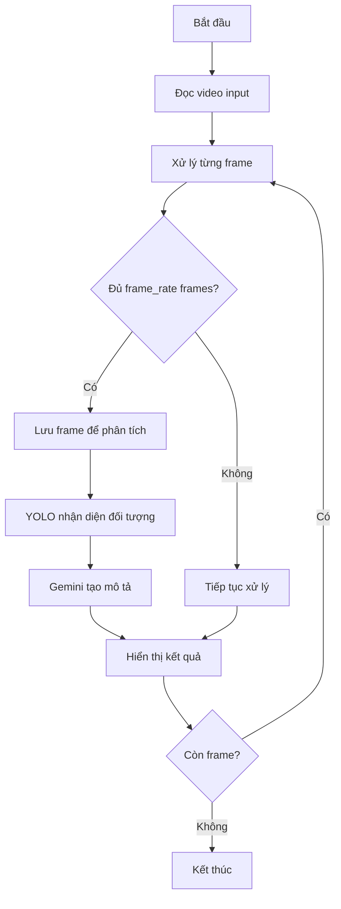
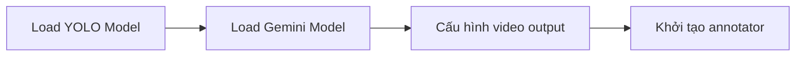
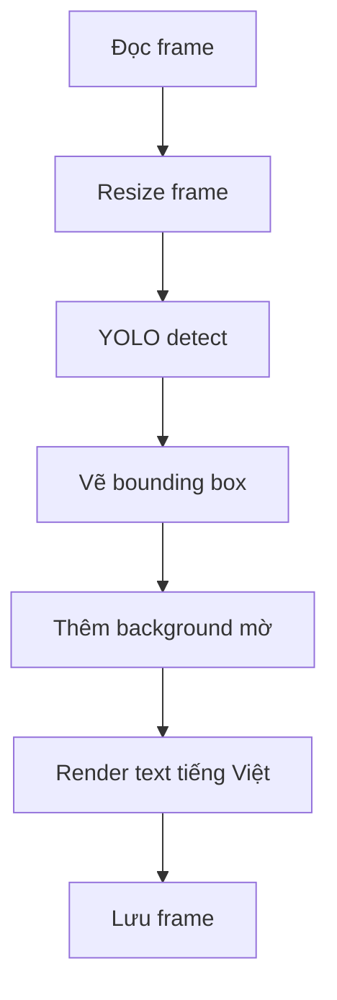
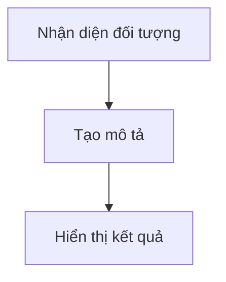

Mô tả tổng quan

1. **Chi tiết các bước xử lý**

2. **Xử lý frame**:

3. **Tích hợp LLM**:

4. ** Kết quả**:

Hệ thống được thiết kế theo hướng module, dễ mở rộng và tùy biến. Mọi thành phần đều có thể được điều chỉnh thông qua các tham số đầu vào.

Liense:[HanBao](https://github.com/BaoHan1712)